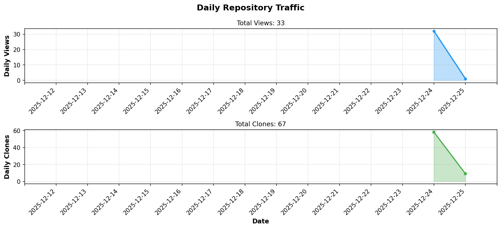
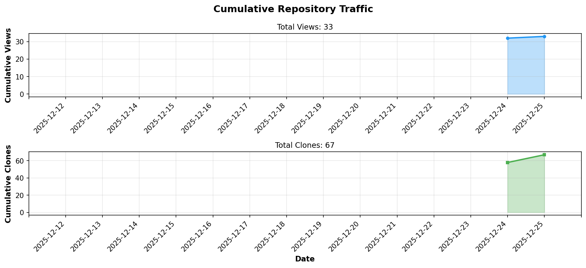

# Baconian

<div align="center">

> **A Rust Project**

[](https://www.rust-lang.org/)
[](LICENSE)

</div>

---

<div align="center">

# Coming soon... Wait a next update please.

</div>

---

## About / 概要

Baconian is a Rust project.

---

<!-- STATS_START -->
## Repository Statistics / リポジトリ統計

<div align="center">

### Daily Traffic / 日次トラフィック



### Cumulative Traffic / 累積トラフィック



| Metric | Count |
|--------|-------|
| **Total Views** / 総閲覧数 | **40** |
| **Total Clones** / 総クローン数 | **77** |

*Last Updated / 最終更新: 2025-12-27 01:32 UTC*

</div>
<!-- STATS_END -->

---

## Installation / インストール

### Prerequisites / 前提条件
- Rust 1.70+ (Install via [rustup](https://rustup.rs/))

### Build & Run / ビルド・実行

```bash
# Clone repository / リポジトリをクローン
git clone https://github.com/BonoJovi/Baconian.git
cd Baconian

# Build / ビルド
cargo build

# Run / 実行
cargo run
```

---

## License / ライセンス

This project is licensed under the MIT License - see the [LICENSE](LICENSE) file for details.

---

<div align="center">

**Made with Rust**

[Report Bug / バグ報告](https://github.com/BonoJovi/Baconian/issues) · [Request Feature / 機能リクエスト](https://github.com/BonoJovi/Baconian/issues)

</div>
